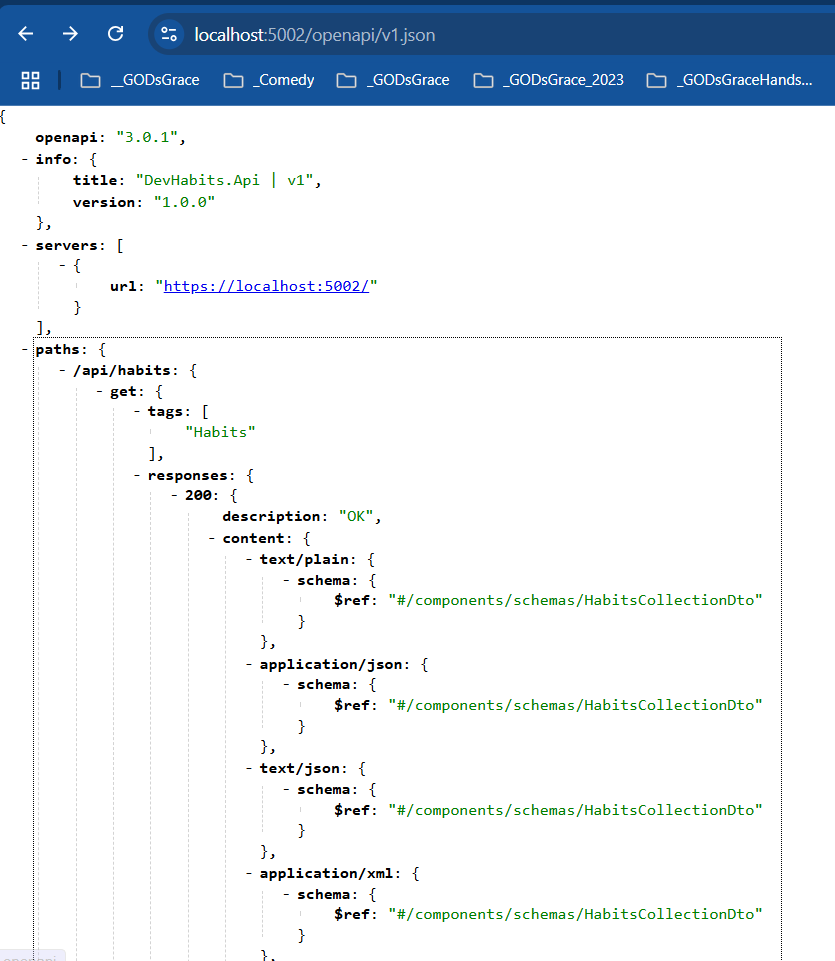
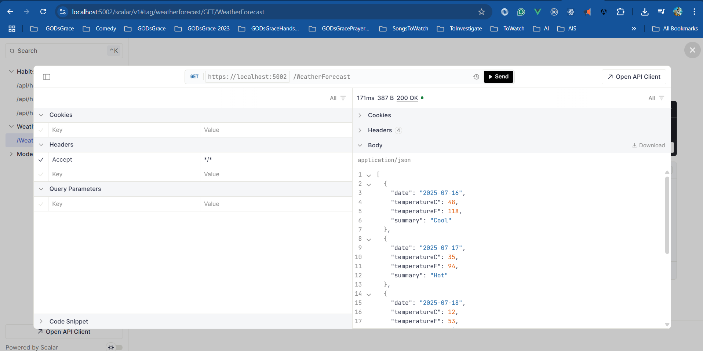

# Developer Habits

I am learning Dev Habits .NET solution from different Video Courses, Books, and Websites

## Reference(s)

> 1. To be done

## URLs

> 1. <https://localhost:5002/openapi/v1.json>
> 1. <https://localhost:5002/scalar/v1>




## EF Migrations

```powershell
Add-Migration Add_Habits -Context ApplicationDbContext -o Migrations/Application
Add-Migration Add_HabitTags -Context ApplicationDbContext -o Migrations/Application
Update-Database -Context ApplicationDbContext
```
